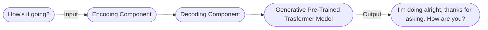

# **learning_IA**

Este espacio de aprendizaje está diseñado para aquellos interesados en adquirir conocimientos básicos sobre el aprendizaje automático y los conceptos fundamentales de la inteligencia artificial (IA). Este repositorio ofrece una variedad de cursos y materiales que cubren una amplia gama de temas relacionados con la IA.

En este curso tu aprenderas a:

- [ ] Definir la IA generativa.
- [ ] Explicar como funciona la IA generativa.
- [ ] Describir los tipos de modelos de IA generativa.
- [ ] Describir las aplicaciones de la IA generativa.

## **¿Que es la IA(Inteligencia Artificial)**

La inteligencia artificial es un campo de la ciencia de la computación que se centra en la creación de programas y máquinas que pueden aprender y tomar decisiones por sí mismas. La IA se puede dividir en dos categorías: IA general e IA estrecha.

IA es la teoría y el desarrollo de sistemas de computación capaces de llevar a cabo tareas que normalmente requieren inteligencia humana, como percepción visual, reconocimiento de voz, toma de decisiones y traducción entre idiomas.

### **¿Que es ML(Machine Learning o Aprendizaje Automatico)?**

El aprendizaje automático es un subconjunto de la IA que se centra en la creación de programas y máquinas que pueden acceder a los datos y usarlos para aprender por sí mismos, es decir, sin intervención humana.

En esta disciplina, tenemos a ML (Machine Learning), el cual es un subcampo de la IA. Es un sistema o programa que entrena un modelo con datos de entrada. Ese modelo entrenado puede dar predicciones útiles de nuevos datos o datos nunca antes vistos, además de poder ser extraído para ser utilizado en el entrenamiento del modelo. ML puede adquirir habilidades computacionales para aprender sin programación explícita. Dos de las clases más comunes de modelos de ML son los modelos supervisados y los no supervisados.

La clave para diferenciar ambos es que, con los modelos **supervisados**, tenemos etiquetas. Los datos etiquetados son aquellos que llegan con una etiqueta, como un nombre, un tipo o un número. Los datos sin etiquetar son aquellos que no llevan una etiqueta. En los modelos de aprendizaje supervisado, los datos ya están etiquetados.

El aprendizaje supervisado es un tipo de aprendizaje automático que se centra en la predicción, es decir, predecir un valor futuro basado en datos históricos. En el aprendizaje supervisado, aprendemos de ejemplos del pasado para poder predecir valores futuros.

El aprendizaje no supervisado es un tipo de aprendizaje automático que se centra en la identificación de patrones en un conjunto de datos. En un modelo de aprendizaje **no supervisado**, los datos no están etiquetados. Los problemas están relacionados con observar los datos sin procesar y ver si se dividen naturalmente en grupos.

El aprendizaje reforzado es un tercer tipo de modelo de ML, en el cual el modelo aprende a través de la prueba y el error. El modelo recibe una recompensa por cada acción que toma, y el objetivo es maximizar esa recompensa.

### **¿Cual es la diferencia entre IA(Inteligencia Artificial) y ML(Machine Learning)?**


Bueno, una forma de pensarlo es que la IA es una disciplina, como la física, por ejemplo. La IA es una rama de la ciencia de la computación que se ocupa de la creación de agentes inteligentes, que son sistemas que pueden razonar, aprender y actuar de forma autónoma. También se puede decir que se diferencian porque la IA es un campo de estudio, mientras que el ML es una herramienta que se puede utilizar para resolver problemas de IA.

## **Deep Learning (Aprendizaje Profundo)**


Ahora que ya hemos hablado un poco sobre las diferencias entre IA y ML, aprendizaje supervisado, aprendizaje no supervisado y aprendizaje reforzado, exploremos brevemente dónde entra el aprendizaje profundo en todo esto.

El deep learning encaja como un subconjunto de los métodos de ML, que se centra en el uso de redes neuronales artificiales para resolver problemas de aprendizaje automático, permitiendo procesar patrones más complejos que el tradicional ML. Mientras que el ML tiene un amplio campo global de diferentes técnicas, el deep learning es un tipo de machine learning que usa redes neuronales artificiales.

Las **redes neuronales artificiales:** Son inspiradas en el cerebro humano, estos estan echos de muchas interconexiones entre nodos o neuronas, que puede aprender a llevar a cabo tareas procesando datos y haciendo predicciones. El modelo de Deep Learning suele tener muchas capas de neuronas, que les permite aprender patrones mas complejos que el modelo ML tradicional. Y las redes neuronales pueden usar tanto datos etiquetados como no etiquetados. Esto es llamado **aprendizaje semi-supervisado.**

En **aprendizaje semi-supervisado**, una red neuronal aprende en una pequeña cantidad de datos etiquetados y en una larga cantidad de datos no etiquetados. Los datos etiquetados ayudadan a la red neuronal a aprender los conceptos basicos de las tareas, mientras que los datos no etiquetados ayudan a la red neuronal a generalizar los nuevos ejemplos.

Ahora nosotros finalmente llegamos a donde la **IA Generativa**


## **¿Qué es la IA generativa?**


La IA generativa es un sub-conjunto del aprendizaje profundo, lo que signidica que usa redes neuronales artificiales y estas pueden procesar ambas tanto datos etiquetados como no etiquetados usando metodos supervisado, no supervisado y semi-supervisado.

La IA generativa es un tipo de tecnología de inteligencia artificial que puede producir varios tipos de contenidos, incluyendo texto, imágenes, audio y datos sintéticos. Pero entonces, ¿qué es la IA? Bueno, ya que vamos a hablar de la IA generativa, vamos a ponerlos un poco en contexto. Entonces, para esto encontramos dos preguntas muy frecuentes: ¿qué es la IA? y ¿cuál es la diferencia entre IA (Inteligencia Artificial) y ML (Machine Learning)?

Los **modelos de lenguaje largo(LLMs)** tambien son un sub-conjunto de la DL (deep learning o aprendizaje profundo), los modelos de deep learning o machine learning en general, pueden ser divididos entre 2 tipos generativos y discriminativos.


**Discriminativos:**

- Son usados para clasificar o predecir.
- Tipicamente entrenado en un conjunto de datos etiquetados.
- Aprende la relación entre las características de los puntos de datos y las etiquetas

**Generativos:**

- Genera nuevos datos que son similares a los datos en los que fue entrenado.
- Entiende la distribución de datos y la probabilidad de que un ejemplo dado prediga la siguiente palabra en una secuencia

Ejemplo:


Como podemos obsevar en la tecnica discriminativa se clasifican los datos en 2 grupos, en este caso perro o gato, mientras que en la tecnica generativa se genera un nuevo dato que puede que genere la imagen de un perro o un gato.

Entonces para resumir el modelo generativo puede generar nuevas instancias de datos mientras que el modelo discriminativo discrimina entre diferentes tipos de instancias de datos. Asi mismo decimos que el modelo tradicional de ML es discriminativo mientras que el modelo de GenAI (Generative AI) es generativo. Ahora veremos **¿Qué es un GenAI?** y **¿Que no lo es?**

**No es un modelo Gen AI:** cuando la salida o Y o etiqueta es un:

- Numero
- Discreto
- Clase
- Probabilidad

**Si es un modelo Gen AI:** cuando Y es un:

- Lenguaje natural (Como el habla, o texto)
- Imagen
- Audio

Para resumir en un alto nivel el modelo tradicional, clasico, supervisado y no supervisado, aprenden procesos de codigo para datos etiquetados o construir un modelo, dependiendo de un caso o problema el modelo puede tener una prediccion, esto puede clasificar algo o agrupar algo. En la programacion tradicional nosotros manejabamos un concepto o una serie de estructuras y reglas como esta:

``` python
...
    Cat:
        type: animal
        legs: 4
        eats: 2
        fur: yes
        likes: catnip, yarn
        (etc ...)
 ...
```

En las olas de redes neuronales | ~2012 en adelante, nosotros podríamos dar a la red fotos de gatos y perros y preguntar nos ¿esto es un gato o un perro? y predecir un gato o perro.

Mientras que en el modelo de lenguaje generativo | LaMDA, PaLM, GPT, etc. Nosotros podemos darle a la red un texto y preguntarle ¿qué sigue? y la red puede generar un texto que puede ser un texto coherente y que tenga sentido.

Ahora vamos a nuestra definicion formal...

## **Que es la IA generativa?**

- Es un tipo de inteligencia artificial que crea nuevo contenido basado en lo que a aprendido del contenido existente.
- Los procesos de aprendizaje de contenido existente se llama entrenamiento y da como resultado la creacion de un modelo estadistico.
- Cuando se le da un aviso, GenAI usa este modelo estadistico para predecir lo, cual podrias ser una respuesta esperada y esto generaria nuevo contenido.

Esencialmente esto aprende de una linea subyacente de los datos y puede generar nuevos ejemplos que son similares a los datos en los que fue entrenado.

Como se menciono anteriormente, un modelo de **lenguaje** generativo:

- El modelo de lengua generativo aprende sobre patrones de lenguaje a traves de datos de entrenamiento, que, dado un texto, y crear algo completamente nuevo basado en la informacion.

Un modelo de imagen generativo:

- Produce nuevas imagenes usando tecnicas como difusion, que, tienen patrones o relaciones entre imagenes, ellos transforman el ruido aleatorio en imágenes o genera imágenes a partir de indicaciones.
- los modelos de lenguaje grande son un tipo de inteligencia artificial generativa ya que ellos generan novedosas conbinaciones de texto en la forma del lenguaje que suena natural.

### **Types of Generative AI Based on Data**


**Un modelo de imagen generativa:** Toma una imagen como entrada y puede generar como salida texto, otra imagen o un video. Por ejemplo:

- Debajo del texto de salida, puede obtener respuestas visuales a las preguntas.
- Mientras que debajo de la imagen de salida, se genera una finalización de imagen.
- Y debjo de la salida de video, se genera una animacion.


**Un modelo de lenguaje generativo:** Toma texto como entrada y puede salir mas texto, una imagen, audio o decisiones. Por ejemplo:

- Debajo de la salida de texto, genera preguntas y respuestas.
- Y debajo de la salida de imagen, genera un video.

Por lo tanto, los modelos de lenguaje generativo son sistemas de coincidencia de patrones. Ellos aprenden sobre patrones basados en los datos que proporcionamos.

Puedes practicar el auto completado y otras caracteristicas en el siguiente link: [Bard Google](https://bard.google.com/?hl=en)

El poder  de la IA generativa provienen del uso de transformadores, los transformadores produjeron una revolucion en 2018 en proceso del lengua natural, a un nivel alto, un modelo de tranformador consiste de un codificador y decodificador, el codificador codifica la secuencia de entrada y lo pasa al decodificador, que aprende a decodificar la representación para una tarea relevante.

### **How it works?** Como funciona?

**Pre-Training** pre-entrenamiento

- Gran cantidad de datos.
- Billones de parametros.
- Aprendizaje no supervisado.



En transformadores, las alucinaciones son palabras o frases que son generadas por el modelo que A menudo son absurdos o gramaticalmente incorrectos.

Las alucinaciones pueden ser causadas por una serie de factores, incluyendo que el modelo no está entrenado con suficientes datos, o el modelo está entrenado en datos ruidosos o sucios, o el modelo no tiene suficiente contexto, o el modelo no tiene suficientes restricciones.

Las alucinaciones pueden ser un problema para los transformadores, porque pueden hacer que el texto de salida sea difícil de entender, tambien pueden hacer mas probable la generacion incorrecta o informacion incorrecta.

### **Hallucinations** Alucinaciones

Challenges: Desafios

- :exclamation: Los modelos no estan entrenados con suficientes datos.
- :exclamation: Los modelos estan entrenados con datos ruidosos o sucios.
- :exclamation: Los modelos no tienen suficiente contexto.
- :exclamation: Los modelos no tienen suficientes restricciones.

### **Prompts**

**Un Prompt (estimulo)** Es una pieza pequeña de texto que se le da al modelo de lenguaje grande como entrada, y puede ser usado para controlar la salida de el modelo en una variedad de formas.

### **Prompt desing** (Diseño de estimulo)

Es el proceso de creación de una solicitud que generará el resultado deseado a partir de un modelo de lenguaje grande.

**Prompt Design:** La cualidad de la entrada determina la cualidad de la salida.


